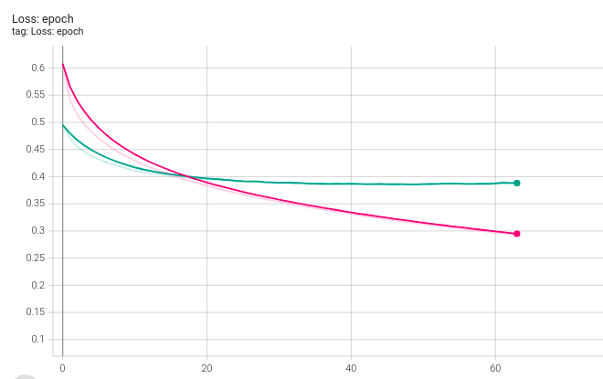
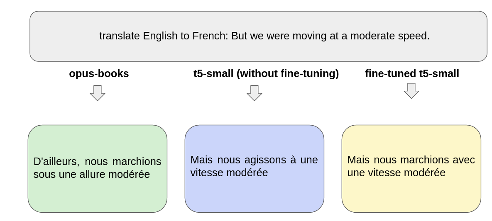
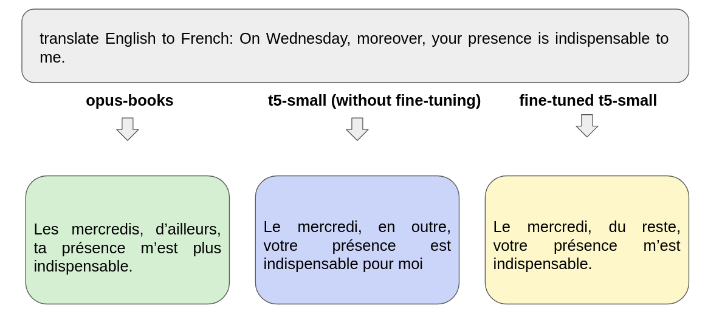

# Text Summarization
Text translation task was implemented with using T5 model on OpusBooks. The T5 model was chosen since this is the one of the most popular models for translation task which wasn't trained on Opus corpus.

 ### Examples
* Example of the translated text for first text

* 
* Example of the translated text for second text
